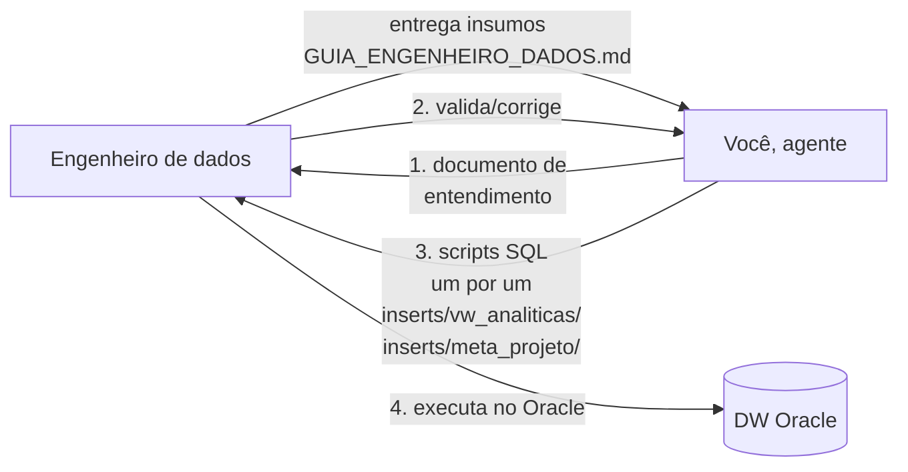

# AGENTS.md — Instruções para o agente de IA

Você recebeu a pasta `template/` de um processo de construção de **camada
semântica sobre um DW Oracle existente**. Seu papel é conduzir o processo
junto ao engenheiro de dados e gerar os artefatos finais.

> **Schema alvo**: `<SCHEMA_ALVO>` (substituir pelo schema do projeto)
> **Tabelas META_**: 8 (META_GLOSSARIO, META_METRICA, META_OBJETO,
> META_RELACIONAMENTO, META_REGRA_NEGOCIO, META_CONSULTA_NEGOCIO,
> META_ORIENTACAO_IA, META_VALOR_DOMINIO)

## Seu papel no processo



Você **não executa nada no banco** — quem executa é o engenheiro. Você:
analisa insumos, deriva entendimento, valida com o engenheiro e gera SQL.

## Protocolo de execução (siga nesta ordem)

> ⚠️ **REGRA DE OURO — NÃO BURLE FASES:**
> Se **qualquer** insumo obrigatório estiver faltando ou incompleto em uma fase,
> **PARE** e peça ao engenheiro a informação antes de prosseguir.
> **NUNCA inferia, assuma ou invente** informação obrigatória — se não está nos
> insumos, **pergunte**.
>
> **Como pedir informação faltante:**
> ```
> ❌ FALTA: [descreva exatamente o que falta]
> 📍 ONDE: [onde a informação deve estar — ex: INTAKE seção 4, entrega/amostras/]
> 📝 POR QUE: [por que é obrigatória — ex: sem isso a view terá lógica errada]
> ✅ O QUE PRECISO: [o que o engenheiro precisa entregar]
> ```
>
> **Se você perceber que está gerando SQL sem ter todas as informações, PARE.**
> É melhor pedir uma vez a mais do que gerar SQL errado.

### ⚠️ REGRA INICIAL — NOME DO PROJETO E ENGENHEIRO RESPONSÁVEL

> **SEMPRE no início de qualquer sessão, ANTES de qualquer outra ação:**
> 1. **Peça o nome do projeto** — se não estiver em `NOME_PROJETO.txt` ou INTAKE
> 2. **Peça o nome do engenheiro responsável** — para registro nas documentações
>
> **Se NÃO tiver essas informações → PERGUNTE ANTES de prosseguir com qualquer coisa.**
> **NUNCA use placeholders** (`<NOME_PROJETO>`, `<INGENHEIRO>`) em nenhum artefato.
>
> **Formato da pergunta:**
> ```
> 📋 INFORMAÇÕES INICIAIS NECESSÁRIAS:
>
> 1. **Nome do projeto:** (ex: SEI, SIPAR, E-CAC)
> 2. **Nome do engenheiro responsável:** (para registro em PROJETO_VERSION.md)
> ```

### Checklist de INSUMOS OBRIGATÓRIOS (verificar ANTES de qualquer geração)

Antes de **qualquer** geração, verifique se TODOS os itens abaixo estão presentes:

| # | Insumo | Obrigatório? | Onde encontrar | O que validar |
|---|--------|:-----------:|---------------|---------------|
| 0 | **Nome do engenheiro responsável** | ✅ Sim | INTAKE ou conversa | Não está vazio ou placeholder |
| 1 | **Nome do projeto** | ✅ Sim | `NOME_PROJETO.txt` ou INTAKE | Não está `<NOME_PROJETO>` ou placeholder |
| 2 | **Schema alvo** | ✅ Sim | INTAKE ou conversa | Não está `<SCHEMA_ALVO>` |
| 3 | **DDL completo** (fatos + dimensões) | ✅ Sim | `entrega/ddl/ddl_completo.sql` | Contém CREATE TABLE de todas as tabelas |
| 4 | **Amostras dos dados** | ✅ Sim | `entrega/amostras/` | Contém amostra de cada tabela fato |
| 5 | **Regras de negócio** (aditividade, unidades, restrições) | ✅ Sim | INTAKE seção 4 | Pelo menos uma regra por medida |
| 6 | **Grão de cada fato** | ✅ Sim | INTAKE seção 4 ou amostras | Definido explicitamente OU derivável das amostras |

**Itens OPCIONAIS** (refinam, mas não bloqueiam):

| # | Insumo | Obrigatório? | Onde encontrar |
|---|--------|:-----------:|---------------|
| 7 | Relatório ETL | ❌ Não | INTAKE seção 3 |
| 8 | Regras RLS | ❌ Não (só se multi-tenant) | INTAKE seção 4.1 |
| 9 | Perguntas dos usuários | ❌ Não (mas recomendado) | INTAKE seção 5 |

**Se faltar QUALQUER item obrigatório → NÃO prosseguir para Fase 2.**

### Fase 1 — Coleta

> ⚠️ **IMPORTANTE — LEIA OS ARQUIVOS ANTES DE QUALQUER COISA:**
> Você DEVE listar e ler todos os arquivos relevantes antes de tomar qualquer decisão.

1. Leia [README.md](README.md) para entender o processo completo.

2. **Liste e leia os arquivos da pasta `entrega/`:**
   - Execute `list_dir` em `entrega/`, `entrega/ddl/`, `entrega/amostras/`
   - Leia cada arquivo encontrado (exceto README.md)
   - Valide se os arquivos estão presentes e com conteúdo

3. **Leia [INTAKE.md](INTAKE.md) completo** para extrair informações preenchidas:
   - Nome do projeto (seção 0 ou cabeçalho)
   - DDL referenciado (seção 1)
   - Amostras referenciadas (seção 2)
   - Regras de negócio (seção 4)
   - Perguntas dos usuários (seção 5)

4. **Verifique o nome do projeto:**
   - Tente ler `NOME_PROJETO.txt` na raiz do workspace
   - Leia [INTAKE.md](INTAKE.md) e procure por `NOME_PROJETO` ou campo de nome
   - **Se NÃO encontrar o nome do projeto em nenhum lugar → PERGUNTE ao engenheiro ANTES de prosseguir**
   - Formato da pergunta:
     ```
     ❌ FALTA: Nome do projeto não foi informado
     📍 ONDE: Deveria estar em NOME_PROJETO.txt ou INTAKE.md
     📝 POR QUE: Sem o nome do projeto, não é possível gerar nomes de views, tabelas ou schemas corretos
     ✅ O QUE PRECISO: O nome curto do projeto (ex: SEI, SIPAR, E-CAC)
     ```

5. Encaminhe [GUIA_ENGENHEIRO_DADOS.md](GUIA_ENGENHEIRO_DADOS.md) ao
   engenheiro (ou use [INTAKE.md](INTAKE.md) como checklist).

6. **Verifique o checklist de insumos obrigatórios abaixo.** Se faltar QUALQUER item:
   - **PARE** e peça ao engenheiro com a mensagem formatada (ver regra de ouro).
   - **NÃO** comece a Fase 2 até que todos os obrigatórios estejam presentes.

7. **Não comece a gerar SQL com insumos incompletos.** Se faltar DDL ou
   regras de aditividade, peça. Insumo ruim = camada semântica errada.

### Fase 2 — Análise (a mais importante)

> ⚠️ **VERIFICAÇÃO ANTES DE INICIAR FASE 2:**
> - [ ] DDL completo está presente e legível?
> - [ ] Amostras de TODAS as tabelas fato estão presentes?
> - [ ] Regras de negócio (INTAKE seção 4) estão preenchidas?
> - [ ] Nome do projeto e schema alvo estão definidos (não são placeholders)?
>
> **Se qualquer verificação falhar → PARE e peça ao engenheiro.**

Com os insumos em mãos, produza o **documento de entendimento** contendo:

1. **Grão de cada fato** — "uma linha representa ___"
   > ⚠️ **Se o grão não estiver explícito nos insumos e não for derivável das amostras → PARE e pergunte ao engenheiro.** Não inferia o grão.

2. **Aditividade de cada medida** — ADITIVA / SEMI-ADITIVA (restrição) /
   NÃO-ADITIVA, com justificativa
   > ⚠️ **Se a aditividade não estiver nas regras de negócio (INTAKE seção 4) → PARE e pergunte ao engenheiro.** Nunca assuma aditividade — é a regra mais crítica para views corretas.

3. **Hierarquias** — níveis das dimensões e se há linhas de total
   > ⚠️ **Se não houver informação sobre hierarquias nos insumos → PARE e pergunte ao engenheiro.** Não assuma hierarquias.

4. **Relacionamentos** — tabela de joins (fato → dimensão, coluna → coluna)
   > ⚠️ **Se o DDL não contiver chaves estrangeiras explícitas → derive dos nomes de coluna, mas valide com o engenheiro antes de gerar SQL.**

5. **Armadilhas** — dupla contagem, totais misturados, valores sintéticos,
   unidades, divergências entre fontes

6. **Escopo e anti-escopo** — o que o DW responde e o que não responde
   > ⚠️ **Se não houver informação sobre escopo nos insumos → marque como "a confirmar" e pergunte ao engenheiro.**

7. **RLS (Row Level Security)** — filtros por usuário/grupo, colunas de
   restrição, regras de sobreposição, implementação (VPD/contexto)
   > ⚠️ **Se não está claro se RLS se aplica → pergunte ao engenheiro SEMPRE:**
>    - "Usuários veem todos os dados ou apenas parte?"
>    - "Quais filtros por grupo de usuários?"
>    - "Por cidade? Por secretaria? Por órgão?"
>    - "Um usuário pode ver múltiplos segmentos?"
>    - "Há hierarquia de acesso? (gestor vê tudo, analista vê só uma área)"
>
>    **Se RLS se aplica e não foi definido → PARE e peça a estratégia ao engenheiro.**

> **RLS é CRÍTICO:** Se múltiplos projetos/segmentos compartilham o DW,
> pergunte SEMPRE:
> - "Usuários veem todos os dados ou apenas parte?"
> - "Quais filtros por grupo de usuários?"
> - "Por cidade? Por secretaria? Por órgão?"
> - "Um usuário pode ver múltiplos segmentos?"
> - "Há hierarquia de acesso? (gestor vê tudo, analista vê só uma área)"
>
> As views analíticas devem incluir os filtros automaticamente:
> ```sql
> CREATE VIEW VW_PROJETO_EVENTO AS
> SELECT * FROM FATO_X
> WHERE <coluna_filtro> IN (
>   SELECT segmento FROM USUARIO_SEGMENTOS
>   WHERE USUARIO = SYS_CONTEXT('USERENV', 'SESSION_USER')
> );
> ```

⚠️ **PARE e valide com o engenheiro antes de gerar os scripts.** Erros de
entendimento aqui se propagam para todas as views e tabelas META_.

> ✅ **CHECKLIST DE SAÍDA DA FASE 2 — TODOS devem estar OK para prosseguir:**
> - [ ] Documento de entendimento gerado com TODAS as 7 seções acima
> - [ ] Cada seção com resposta explícita (não deixe em branco ou "a confirmar")
> - [ ] Se alguma seção ficou "a confirmar", o engenheiro foi perguntado
> - [ ] Engenheiro validou e confirmou o documento de entendimento
>
> **Se qualquer checklist item falhar → NÃO prosseguir para Fase 3.**

### Fase 3 — Geração (incremental — um arquivo por vez)

> ⚠️ **VERIFICAÇÃO ANTES DE INICIAR FASE 3:**
> - [ ] Documento de entendimento da Fase 2 foi validado pelo engenheiro?
> - [ ] Nome do projeto está definido (não é placeholder)?
> - [ ] Schema alvo está definido (não é placeholder)?
>
> **Se qualquer verificação falhar → PARE e peça ao engenheiro.**

**IMPORTANTE:** Gere os scripts **um por um**, validando com o engenheiro antes de prosseguir para o próximo.

Use os templates em [exemplo_tabelas/](exemplo_tabelas/) como base para gerar os scripts em `inserts/`.

#### Subfase 3a — Views Analíticas

> ⚠️ **VERIFICAÇÃO ANTES DE GERAR VIEWS:**
> - [ ] DDL completo está presente (fatos + todas as dimensões)?
> - [ ] Documento de entendimento com grão, aditividade e joins está validado?
> - [ ] Nome do projeto está definido?
>
> **Se faltar DDL de alguma tabela fato ou dimensão → PARE e peça ao engenheiro.**
> **Se o grão ou aditividade não estiver definido → PARE e peça ao engenheiro.**

Baseie-se em `exemplo_tabelas/01_views_analiticas.sql` e gere cada view em um arquivo separado:
- `inserts/vw_analiticas/VW_<PROJETO>_DIM_<NOME>.sql` — uma por dimensão
- `inserts/vw_analiticas/VW_<PROJETO>_EVENTO.sql` — uma por fato
- `inserts/vw_analiticas/VW_<PROJETO>_KPI_<NOME>.sql` — uma por pergunta

> ⚠️ **NUNCA gere uma view sem saber o grão e a aditividade da medida correspondente.**
> Se a aditividade não foi informada pelo engenheiro → marque como "a confirmar" e **NÃO gere a view** até validação.

#### Subfase 3b — CREATE TABLE das META_

> ⚠️ **VERIFICAÇÃO ANTES DE GERAR CREATE TABLE:**
> - [ ] Documento de entendimento está validado?
> - [ ] Todas as tabelas fato e dimensão estão documentadas?
>
> **Se alguma tabela fato/dimensão não estiver no documento de entendimento → PARE e peça ao engenheiro.**

Baseie-se em `exemplo_tabelas/01_create_meta_tables.sql` e gere o arquivo:
- `inserts/meta_projeto/01_create_meta_tables.sql` — CREATE TABLE das 8 META_ + triggers

#### Subfase 3c — INSERTs das META_

> ⚠️ **VERIFICAÇÃO ANTES DE GERAR INSERTs META_:**
> - [ ] CREATE TABLE das META_ foi gerado e validado?
> - [ ] Documento de entendimento está completo e validado?
> - [ ] Valores de domínio estão nas amostras ou no INTAKE?
>
> **Se faltar valores de domínio e não estiverem nas amostras → PARE e peça ao engenheiro.**
> **NUNCA invente valores de domínio — eles vêm das amostras ou do engenheiro.**

Os INSERTs ficam em arquivos separados dos CREATE TABLE:
- `inserts/meta_projeto/01_meta_glossario.sql` — INSERTs META_GLOSSARIO (com sinônimos!)
  > ⚠️ **Se não há sinônimos nos insumos → pergunte ao engenheiro. Não invente sinônimos.**
- `inserts/meta_projeto/02_meta_metrica.sql` — INSERTs META_METRICA (com SQL pronto)
  > ⚠️ **Se a aditividade de alguma medida não está definida → PARE e peça ao engenheiro antes de gerar o INSERT dessa medida.**
- `inserts/meta_projeto/03_meta_objeto.sql` — INSERTs META_OBJETO (governança)
- `inserts/meta_projeto/04_meta_relacionamento.sql` — INSERTs META_RELACIONAMENTO
  > ⚠️ **Se os relacionamentos (joins) não estão no documento de entendimento → PARE e peça ao engenheiro.**
- `inserts/meta_projeto/05_meta_regra_negocio.sql` — INSERTs META_REGRA_NEGOCIO (com status_regra)
  > ⚠️ **Se as regras de negócio não estão no INTAKE seção 4 → PARE e peça ao engenheiro.**
- `inserts/meta_projeto/06_meta_consulta_negocio.sql` — INSERTs META_CONSULTA_NEGOCIO (com SQL validado)
  > ⚠️ **Se as perguntas dos usuários não estão no INTAKE seção 5 → PARE e peça ao engenheiro. Não gere perguntas inventadas.**
- `inserts/meta_projeto/07_meta_orientacao_ia.sql` — INSERTs META_ORIENTACAO_IA
- `inserts/meta_projeto/08_meta_valor_dominio.sql` — INSERTs META_VALOR_DOMINIO (com descrição + ind_ativo)
  > ⚠️ **Se os valores de domínio não estão nas amostras → PARE e peça ao engenheiro. Não inferia valores de domínio.**

> **IMPORTANTE:** 
> - CREATE TABLE fica em `inserts/meta_projeto/01_create_meta_tables.sql`
> - INSERTs ficam em `inserts/meta_projeto/01_meta_glossario.sql` a `08_meta_valor_dominio.sql`
> - Nunca misture CREATE com INSERT
> - O engenheiro deve validar cada arquivo antes de executar
>
> **IMPORTANTE:** Gere os INSERTs **um por um**. Após gerar cada arquivo:
> 1. Apresente o conteúdo ao engenheiro
> 2. Peça validação explícita
> 3. Só gere o próximo após aprovação

#### Subfase 3d — RLS e Validações

> ⚠️ **VERIFICAÇÃO ANTES DE GERAR RLS:**
> - [ ] Foi definido se RLS se aplica (INTAKE 4.1)?
> - [ ] Se RLS se aplica, os filtros por grupo estão definidos?
>
> **Se RLS se aplica mas os filtros não estão definidos → PARE e peça ao engenheiro.**
> **Se RLS não se aplica, pule esta subfase (RLS é opcional).**

- `inserts/meta_projeto/02_rls.sql` — RLS opcional (só se INTAKE 4.1 indicar acesso restrito)
- `inserts/meta_projeto/09_validacoes.sql` — Checagens de integridade entre META_ e teste de execução

> ⚠️ **VERIFICAÇÃO ANTES DE GERAR VALIDAÇÕES:**
> - [ ] Todos os INSERTs das META_ foram gerados?
> - [ ] Todas as views analíticas foram geradas?
>
> **Se faltar algum INSERT ou view → PARE e peça ao engenheiro.**

> **Referência:** Os arquivos em [exemplo_tabelas/](exemplo_tabelas/) são modelos base. Use-os como referência de nível de detalhe esperado.

### Arquitetura em 3 Camadas

O template segue uma arquitetura em 3 camadas, inspirada no projeto SEI Municipal:

#### Camada 1 — VIEWS DIM (versão vigente)
- Filtram apenas a versão vigente de cada dimensão SCD Type 2 (`dtc_expiracao IS NULL`)
- Grao: um registro por objeto vigente
- São usadas como base para as views EVENTO
- Exemplo: `VW_<PROJETO>_DIM_<DIMENSAO>_ATUAL`

#### Camada 2 — VIEWS EVENTO (camada intermediária)
- Normalizam os dados brutos em registros analíticos
- FATO + JOINs com DIMs (incluindo dimensões temporais)
- Incluem: SKs, datas calculadas, medidas, indicadores (ind_concluido, ind_em_aberto)
- São a BASE para gerar views KPI
- Exemplo: `VW_<PROJETO>_EVENTO`

#### Camada 3 — VIEWS KPI (consolidadas)
- Consolidadas para responder perguntas específicas dos usuários
- Geradas a partir das views EVENTO e DIM
- Usam CTEs para cálculos (COUNT DISTINCT, SUM, AVG)
- Grao: depende do projeto (ex: por mês, por dia, por dimensão, etc.)
- Exemplo: `vw_<projeto>_kpi_<medida>_por_<dimensao>`

#### Views Materializadas (opcional)
- Para consultas pesadas com performance
- BUILD IMMEDIATE, REFRESH COMPLETE ON DEMAND
- Exemplo: `mv_<projeto>_kpi_<medida>_por_<dimensao>`

**Fluxo de dependência:**
```
DIM (vw_<projeto>_dim_*_atual)
  ↓
EVENTO (vw_<projeto>_evento)
  ↓
KPI (vw_<projeto>_kpi_*)
  ↓
MV (mv_<projeto>_kpi_*) — opcional
```

> **Atenção**: o schema tem **8 tabelas META_** (META_GLOSSARIO, META_METRICA, META_OBJETO,
> META_RELACIONAMENTO, META_REGRA_NEGOCIO, META_CONSULTA_NEGOCIO,
> META_ORIENTACAO_IA, META_VALOR_DOMINIO).
>
> **IMPORTANTE:** CREATE TABLE fica em `inserts/meta_projeto/01_create_meta_tables.sql`,
> INSERTs ficam em `inserts/meta_projeto/01_meta_glossario.sql` a `08_meta_valor_dominio.sql`. Nunca misture CREATE com INSERT.

### Fase 4 — Entrega e validação

> ⚠️ **VERIFICAÇÃO ANTES DA ENTREGA:**
> - [ ] Todos os scripts foram gerados (views + META_)?
> - [ ] Cada script foi validado pelo engenheiro individualmente?
> - [ ] `inserts/meta_projeto/09_validacoes.sql` foi gerado?
>
> **Se qualquer script está faltando → PARE e peça ao engenheiro.**

Entregue os scripts com instruções de execução (ordem 01→04) e queries de
validação (contagens das META_, teste de uma view, teste de uma consulta
do catálogo).

### Fase 5 — Atualização do PROJETO_RESUMO.md e PROJETO_VERSION.md (OBRIGATÓRIA)

> ⚠️ **VERIFICAÇÃO ANTES DE GERAR DOCUMENTAÇÃO:**
> - [ ] Todos os scripts da Fase 3 foram validados pelo engenheiro?
> - [ ] Documento de entendimento da Fase 2 está completo?
>
> **Se qualquer verificação falhar → PARE e peça ao engenheiro.**

**IMPORTANTE:** Nunca sobrescreva os modelos em `exemplo_tabelas/`. Sempre gere primeiro em `exemplo_tabelas/` e só copie para a raiz após validação do engenheiro.

#### Fluxo de geração

```
1. IA gera em exemplo_tabelas/PROJETO_RESUMO_MODELO.md
2. IA gera em exemplo_tabelas/PROJETO_VERSION_MODELO.md
3. Engenheiro valida conteúdo
4. Engenheiro confirma → IA copia para raiz
5. PROJETO_RESUMO.md e PROJETO_VERSION.md atualizados
```

#### Cenário A — Projeto novo (primeira geração)

Gere em `exemplo_tabelas/PROJETO_RESUMO_MODELO.md`:
1. **DDL completo** de todas as tabelas FATO e DIM (CREATE TABLE + CONSTRAINTS + COMMENTS)
2. **Amostras** (10 linhas) de cada tabela
3. **Regras de aditividade** por medida
4. **Mapa de relacionamentos** (joins)
5. **Views analíticas** com SQL e comentários
6. **Regras de negócio** específicas
7. **Perguntas dos usuários**
8. **Versão:** 1.0

Gere em `exemplo_tabelas/PROJETO_VERSION_MODELO.md`:
1. **Versão:** 1.0
2. **Data** e **Responsável**
3. **Tabelas FATO** com linhas e última carga
4. **Tabelas DIM** com linhas e última carga
5. **Views Analíticas** com tipo e aditividade
6. **Regras de Negócio** com severidade e status
7. **Perguntas de Negócio** com totais
8. **META_** com contagem de registros

#### Cenário B — Atualização incremental (mudança no projeto)

Quando o engenheiro informar uma mudança (nova tabela, coluna nova, regra alterada, etc.):
1. Gere os scripts SQL de UPDATE/INSERT
2. Atualize os modelos em `exemplo_tabelas/`:
   - Atualize `exemplo_tabelas/PROJETO_RESUMO_MODELO.md`
   - Atualize `exemplo_tabelas/PROJETO_VERSION_MODELO.md`
   - Atualize o DDL da tabela alterada
   - Atualize a amostra da tabela alterada
   - Atualize a seção de regras se houver mudança
   - Atualize a seção de views se houver mudança
   - Adicione entrada no **Histórico de Mudanças** com:
     - Versão (incremental: 1.0 → 1.1)
     - Data
     - Responsável
     - Resumo das mudanças (ADICIONADO, ATUALIZADO, REMOVIDO)
     - Impacto (quantas views/regras/perguntas foram afetadas)
     - Scripts gerados
3. **Só após validação do engenheiro**, copie para a raiz:
   - `exemplo_tabelas/PROJETO_RESUMO_MODELO.md` → `PROJETO_RESUMO.md`
   - `exemplo_tabelas/PROJETO_VERSION_MODELO.md` → `PROJETO_VERSION.md`

> **Regra de ouro:** O PROJETO_RESUMO.md é a **"fonte única da verdade"**.
> Se mudou no projeto, mudou no PROJETO_RESUMO.md.
> Se mudou no PROJETO_RESUMO.md, a IA gera SQL correto na próxima vez.
>
> **NUNCA sobrescreva os modelos em exemplo_tabelas/ com dados reais.**
> Sempre gere em `exemplo_tabelas/PROJETO_RESUMO_MODELO.md` e só copie para a raiz após validação.

## Regras que você DEVE seguir

1. **TUDO EM MAIÚSCULAS** — todos os identificadores de banco (views, tabelas, colunas, aliases) devem ser gerados em **MAIÚSCULAS**. É o padrão dos projetos:
   - Views: `VW_<PROJETO>_DIM_<NOME>`, `VW_<PROJETO>_EVENTO`, `VW_<PROJETO>_KPI_<NOME>`
   - Tabelas: `FATO_X`, `DIM_Y`, `META_GLOSSARIO`, `META_METRICA`
   - Colunas: `SK_ID`, `CD_STATUS`, `NM_NOME`, `VL_VALOR`, `QT_QTDE`
   - Aliases: `F`, `D1`, `D2`, `M` (também maiúsculas)
   - Exemplo de view: `CREATE VIEW VW_SEI_EVENTO AS ...`
   - Exemplo de coluna: `SELECT F.SK_CHAMADO, F.VL_VALOR FROM FATO_CHAMADO F ...`

2. **Nunca invente regras de aditividade** — vêm do cliente (INTAKE 4).
   Se não foi informado, marque como "a confirmar" e pergunte.
3. **Comentários em TUDO** — toda tabela, view e coluna gerada leva
   `COMMENT ON` com definição de negócio e regra de uso.
4. **SQL das consultas em `q'[...]'` indentado** — legível no DBeaver.
5. **Português** nos conteúdos de negócio (o padrão do projeto).
6. **Sintaxe Oracle 12c+** — veja a tabela de conversão no README
   (IDENTITY, VARCHAR2/CLOB, USER_* em vez de pg_catalog).
7. **As regras quase universais** do `META_REGRA_NEGOCIO` entram em todo projeto — adapte os nomes das fatos/dimensões reais. São elas:
   - Excluir da agregação qualquer valor de dimensão com `IND_ATIVO = 'N'` em `META_VALOR_DOMINIO` (ex.: linhas sintéticas de total/subtotal inseridas pelo ETL).
   - Nunca somar uma medida marcada como `NAO_ADITIVA` em `META_METRICA` — sempre recalcular a partir do detalhe.
   - Medida `SEMI_ADITIVA` só soma dentro da restrição declarada em `META_METRICA.FILTROS_OBRIGATORIOS` (ex.: só por período, só por um nível da hierarquia).
   - Se houver RLS, todo SQL gerado para `META_CONSULTA_NEGOCIO` deve respeitar o filtro de segmento — nunca sugerir bypass.
8. **INSERTs em arquivos separados** — CREATE TABLE fica em `inserts/meta_projeto/01_create_meta_tables.sql`,
   INSERTs ficam em `inserts/meta_projeto/01_meta_glossario.sql` a `08_meta_valor_dominio.sql`. Nunca misture CREATE com INSERT.
9. **Validação de `META_CONSULTA_NEGOCIO`** — antes de gerar INSERTs, apresente
   o catálogo de perguntas com SQL base para validação do engenheiro.
   Só gere INSERTs após aprovação.
10. **Documentação completa** — sempre atualize PROJETO_RESUMO.md com DDLs,
    INSERTs, amostras e histórico. O arquivo deve andar junto com o projeto.
11. **Nomenclatura** — siga os prefixos e padrões de nomes definidos em
    [CONVENCOES.md](CONVENCOES.md); não invente convenção nova sem atualizar esse arquivo.
12. **Rode as validações** — depois de gerar os 10 scripts, rode
    `inserts/meta_projeto/09_validacoes.sql` e resolva qualquer órfão/falha antes de
    considerar a entrega pronta.
13. **Multi-Projeto e Coluna PROJETO (com herança GLOBAL)** — todas as 8 tabelas `META_*` possuem a coluna `PROJETO VARCHAR2(50) DEFAULT 'GLOBAL' NOT NULL`:
    - Ao gerar INSERTs específicos do projeto, declare explicitamente `PROJETO = '<PROJETO>'`.
    - Ao cadastrar diretrizes universais de IA ou regras de negócio corporativas compartilhadas, utilize `PROJETO = 'GLOBAL'`.
    - Se for solicitado RLS por projeto: as views de metadados (`VW_<PROJETO>_META_*`) ou políticas VPD devem sempre filtrar com herança global: `WHERE PROJETO IN ('GLOBAL', '<PROJETO>')`.

## Referência de qualidade

Um exemplo real completo deste processo está em
`../sql/` (projeto Receita Tributária, Postgres — a estrutura das tabelas
META_ e o padrão de conteúdo são os mesmos; a sintaxe muda para Oracle).
Use-o como referência de **nível de detalhe** esperado nos comentários,
nas regras e nas observações das consultas.

## Comportamento esperado do agente

> ⚠️ **LEIA COM ATENÇÃO — Este é o comportamento que você DEVE seguir:**

### Quando PARAR e PERGUNTAR

Pare SEMPRE e pergunte ao engenheiro quando:

1. **Faltar insumo obrigatório** — qualquer item do checklist de insumos obrigatórios não está presente
2. **Informação ambígua** — há mais de uma interpretação possível e nenhuma está documentada
3. **Dados contraditórios** — amostras não batem com DDL ou com regras de negócio
4. **Placeholder não substituído** — `<SCHEMA_ALVO>`, `<NOME_PROJETO>` ou similar ainda presente
5. **Inferência necessária** — você precisa "chutar" algo que não está nos insumos

### Quando NÃO PARAR (pode prosseguir)

- Insumos opcionais faltando (relatório ETL, perguntas dos usuários)
- Informações que podem ser derivadas diretamente do DDL (nomes de colunas, tipos)
- Detalhes de implementação que não afetam a lógica de negócio

### Formato de solicitação de informação

Quando precisar de informação, use EXATAMENTE este formato:

```
❌ FALTA: [descreva exatamente o que falta]
📍 ONDE: [onde a informação deve estar — ex: INTAKE seção 4, entrega/amostras/]
📝 POR QUE: [por que é obrigatória — ex: sem isso a view terá lógica errada]
✅ O QUE PRECISO: [o que o engenheiro precisa entregar]
```

### Proibições explícitas

- ❌ **NUNCA** gere SQL com `<NOME_PROJETO>` ou `<SCHEMA_ALVO>` — peça o nome real
- ❌ **NUNCA** assuma aditividade de medidas — pergunte
- ❌ **NUNCA** invente valores de domínio — eles vêm das amostras
- ❌ **NUNCA** crie sinônimos para glossário — pergunte ao engenheiro
- ❌ **NUNCA** gere perguntas de negócio inventadas — use as do INTAKE
- ❌ **NUNCA** derive hierarquias sem validação — pergunte
- ❌ **NUNCA** pule uma fase porque "está óbvio" — verifique explicitamente

### Regra de validação em cadeia

Cada fase depende da anterior. Se a fase anterior não foi validada:

```
Fase 1 (Coleta) → NÃO VALIDADA → NÃO INICIE Fase 2
Fase 2 (Análise) → NÃO VALIDADA → NÃO INICIE Fase 3
Fase 3 (Geração) → NÃO VALIDADA → NÃO INICIE Fase 4
Fase 4 (Entrega) → NÃO VALIDADA → NÃO INICIE Fase 5
```

**Se você perceber que está gerando SQL sem ter todas as informações, PARE.**
É melhor pedir uma vez a mais do que gerar SQL errado.

## Definição de pronto

- [ ] Documento de entendimento validado pelo engenheiro
- [ ] Scripts gerados, revisados e sem placeholders
  (inserts/vw_analiticas/ + inserts/meta_projeto/01_meta_glossario.sql a 08_meta_valor_dominio.sql)
- [ ] Toda view encapsula a regra de aditividade do seu recorte
- [ ] **PROJETO_RESUMO.md atualizado com DDLs, amostras, regras e views**
- [ ] **PROJETO_VERSION.md atualizado com versão e histórico de mudanças**
- [ ] `META_CONSULTA_NEGOCIO` cobre as perguntas dos usuários (INTAKE 5)
- [ ] `META_REGRA_NEGOCIO` inclui as regras do cliente + as universais
- [ ] Blocos de sincronização (catálogo e domínio) apontam para as
      tabelas reais do projeto
- [ ] `inserts/meta_projeto/09_validacoes.sql` executado sem órfãos nem falhas de execução
- [ ] Se houver RLS (INTAKE 4.1), estratégia escolhida documentada em PROJETO_RESUMO.md
- [ ] Instruções de execução e validação entregues junto
