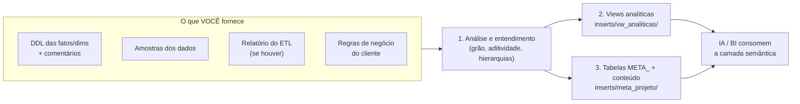

# Template — Camada Semântica sobre DW existente (Oracle)

Processo reutilizável para construir a **camada semântica** (views analíticas +
tabelas `META_`) sobre um Data Warehouse **já existente em Oracle** — fatos e
dimensões já foram criadas e carregadas pelo ETL de outra equipe/projeto.

> Ponto de partida: o DW existe. O trabalho aqui é **entender o DW e gerar a
> camada semântica** que permite a analistas e IAs (text-to-SQL) usá-lo bem.

## O fluxo



## Estrutura do template

```
template/
├── README.md                  <- este guia (visão geral do processo)
├── AGENTS.md                  <- instruções para o agente de IA executor
├── GUIA_ENGENHEIRO_DADOS.md   <- roteiro de entrega para o engenheiro
├── INTAKE.md                  <- formulário de coleta dos insumos
├── CONVENCOES.md              <- dicionário de prefixos e nomenclatura
├── PROJETO_RESUMO.md          <- documentação central (gerado pela IA após validação)
├── PROJETO_VERSION.md         <- histórico de mudanças (gerado pela IA após validação)
├── CHECKLIST_VALIDACAO.md     <- checklist de validação antes de executar
├── entrega/                   <- pasta pronta para o engenheiro depositar os insumos
│   ├── README.md
│   ├── ddl/                   <- ddl_completo.sql (Seção 1 do GUIA)
│   └── amostras/              <- inventário, categóricas e amostras (Seção 2 do GUIA)
└── exemplo_tabelas/           <- modelo base (referência, não executar)
    ├── 01_views_analiticas.sql    <- referência de views VW_* (Oracle)
    ├── 01_create_meta_tables.sql  <- referência CREATE TABLE das 8 META_
    ├── 02_rls_template.sql        <- referência RLS opcional
    ├── 09_validacoes.sql          <- referência validações
    ├── PROJETO_RESUMO_MODELO.md   <- modelo de documentação (gerado pela IA)
    ├── PROJETO_VERSION_MODELO.md  <- modelo de versão (gerado pela IA)
    └── inserts/
        ├── README.md              <- guia de execução dos inserts
        ├── 01_meta_glossario.sql  <- referência INSERTs META_GLOSSARIO
        ├── 02_meta_metrica.sql    <- referência INSERTs META_METRICA
        ├── 03_meta_objeto.sql     <- referência INSERTs META_OBJETO
        ├── 04_meta_relacionamento.sql <- referência INSERTs META_RELACIONAMENTO
        ├── 05_meta_regra_negocio.sql  <- referência INSERTs META_REGRA_NEGOCIO
        ├── 06_meta_consulta_negocio.sql <- referência INSERTs META_CONSULTA_NEGOCIO
        ├── 07_meta_orientacao_ia.sql  <- referência INSERTs META_ORIENTACAO_IA
        └── 08_meta_valor_dominio.sql  <- referência INSERTs META_VALOR_DOMINIO
└── inserts/                   <- scripts gerados pela IA (executáveis)
    ├── README.md              <- guia geral de execução
    ├── vw_analiticas/         <- views DIM, EVENTO, KPI (um arquivo por view)
    │   └── README.md
    └── meta_projeto/          <- CREATE TABLE + INSERTs META_
        ├── README.md
        ├── 01_create_meta_tables.sql  <- CREATE TABLE das 8 META_ + triggers
        ├── 01_meta_glossario.sql      <- INSERTs META_GLOSSARIO
        ├── 02_meta_metrica.sql        <- INSERTs META_METRICA
        ├── 03_meta_objeto.sql         <- INSERTs META_OBJETO
        ├── 04_meta_relacionamento.sql <- INSERTs META_RELACIONAMENTO
        ├── 05_meta_regra_negocio.sql  <- INSERTs META_REGRA_NEGOCIO
        ├── 06_meta_consulta_negocio.sql <- INSERTs META_CONSULTA_NEGOCIO
        ├── 07_meta_orientacao_ia.sql  <- INSERTs META_ORIENTACAO_IA
        ├── 08_meta_valor_dominio.sql  <- INSERTs META_VALOR_DOMINIO
        ├── 02_rls.sql                 <- RLS opcional
        └── 09_validacoes.sql          <- validações
```

## Arquitetura em 3 Camadas

O projeto segue uma arquitetura em 3 camadas, inspirada no projeto SEI Municípios:

### Camada 1 — VIEWS DIM (versão vigente)
- Filtram apenas a versão vigente de cada dimensão SCD Type 2 (`DTC_EXPIRACAO IS NULL`)
- Grao: um registro por objeto vigente
- São usadas como base para as views EVENTO
- Exemplo: `VW_<PROJETO>_DIM_<DIMENSAO>_ATUAL`

### Camada 2 — VIEWS EVENTO (camada intermediária)
- Normalizam os dados brutos em registros analíticos
- FATO + JOINs com DIMs (incluindo dimensões temporais)
- Incluem: SKs, datas calculadas, medidas, indicadores (IND_CONCLUIDO, IND_EM_ABERTO)
- São a BASE para gerar views KPI
- Exemplo: `VW_<PROJETO>_EVENTO`

### Camada 3 — VIEWS KPI (consolidadas)
- Consolidadas para responder perguntas específicas dos usuários
- Geradas a partir das views EVENTO e DIM
- Usam CTEs para cálculos (COUNT DISTINCT, SUM, AVG)
- Grao: depende do projeto (ex: por mês, por dia, por dimensão, etc.)
- Exemplo: `VW_<PROJETO>_KPI_<MEDIDA>_POR_<DIMENSAO>`
- Exemplo: `VW_<PROJETO>_KPI_<MEDIDA>_POR_<DIMENSAO>`

### Views Materializadas (opcional)
- Para consultas pesadas com performance
- BUILD IMMEDIATE, REFRESH COMPLETE ON DEMAND
- Exemplo: `mv_<projeto>_kpi_<medida>_por_<dimensao>`

**Fluxo de dependência:**
```
DIM (vw_<projeto>_dim_*_atual)
  ↓
EVENTO (vw_<projeto>_evento)
  ↓
KPI (vw_<projeto>_kpi_*)
  ↓
MV (mv_<projeto>_kpi_*) — opcional
```

## Como o template é usado

1. **Agente de IA** lê [AGENTS.md](AGENTS.md) — protocolo de 4 fases
   (coleta → análise → geração → entrega), regras obrigatórias e
   definição de pronto
2. **Engenheiro de dados** segue [GUIA_ENGENHEIRO_DADOS.md](GUIA_ENGENHEIRO_DADOS.md)
   — o que extrair do DW e como empacotar
3. Os [scripts inserts/](inserts/) são a **estrutura**; o conteúdo é gerado a
   partir dos insumos validados

## Referência de implementação

> **Nota:** Um exemplo real completo deste processo (DW de Receita
> Tributária, em Postgres) pode estar disponível no diretório pai.
> Use como referência do nível de detalhe esperado — a estrutura das
> META_ é idêntica, muda a sintaxe para Oracle.

## Passo 1 — Coleta de insumos (checklist do que me enviar)

Use o [INTAKE.md](INTAKE.md) como formulário. O mínimo necessário:

| # | Insumo | Para que serve | Obrigatório? |
|---|--------|----------------|:---:|
| 1 | **DDL das fatos e dimensões** (com comentários, se houver) | Estrutura, tipos, PKs/FKs | ✔ |
| 2 | **Amostras dos dados** (10–50 linhas por tabela, ou contagens/distincts) | Descobrir valores de domínio, hierarquias, linhas de total | ✔ |
| 3 | **Relatório/documentação do ETL** | Regras de carga, de-paras, tratamentos, o que é sintético | Recomendado |
| 4 | **Regras de negócio do cliente** | Aditividade, filtros obrigatórios, o que NÃO pode ser feito | ✔ |
| 5 | Perguntas que os usuários querem responder | Conteúdo da `meta_consulta_negocio` | Recomendado |

> **Quem gera esses insumos é o engenheiro de dados do DW?** Encaminhe o
> [GUIA_ENGENHEIRO_DADOS.md](GUIA_ENGENHEIRO_DADOS.md) — roteiro passo a
> passo (queries prontas, questionários e formato de empacotamento) para
> ele entregar tudo sem idas e vindas.

## Passo 2 — O que eu derivo dos insumos

Antes de gerar SQL, documento (e confirmo com você):

1. **Grão de cada fato** — o que UMA linha representa
2. **Aditividade de cada medida** — soma livre / com restrição / nunca
3. **Hierarquias das dimensões** — níveis, e se há linhas de total agregadas
4. **Relacionamentos** — quais chaves ligam fatos e dimensões
5. **Valores de domínio** — valores exatos das colunas categóricas (dos dados)
6. **Armadilhas** — dupla contagem, linhas de total misturadas, fontes divergentes

## Passo 3 — O que eu gero

| Script | Conteúdo |
|---|---|
| [inserts/vw_analiticas/](inserts/vw_analiticas/) | Views `VW_*` com as regras de uso encapsuladas (filtro de nível, exclusão de totais, medidas derivadas) + COMMENTs |
| [inserts/meta_projeto/01_create_meta_tables.sql](inserts/meta_projeto/01_create_meta_tables.sql) | `CREATE TABLE` das 8 META_ (executar uma vez) |
| [inserts/meta_projeto/01_meta_glossario.sql](inserts/meta_projeto/) a [08_meta_valor_dominio.sql](inserts/meta_projeto/) | INSERTs para cada META_ (executar em ordem) |
| [inserts/meta_projeto/02_rls.sql](inserts/meta_projeto/02_rls.sql) | RLS opcional (só se o INTAKE indicar acesso restrito) |
| [inserts/meta_projeto/09_validacoes.sql](inserts/meta_projeto/09_validacoes.sql) | Checagens de integridade entre META_ e teste de execução das views/consultas |

Todos em **sintaxe Oracle** (12c+): `NUMBER GENERATED AS IDENTITY`,
`VARCHAR2`/`CLOB`, catálogo `USER_*`, quoting `q'[...]'` para SQLs com aspas.

## Convenções do padrão (não reinventar)

1. Views são o **contrato de uso**: regras de agregação encapsuladas
2. Comentários (`COMMENT ON`) em **toda** tabela, view e coluna
3. Camada semântica **dentro do banco** (`META_*`), não em documento solto
4. INSERTs em arquivos separados — nunca misture CREATE com INSERT
5. Perguntas de negócio sempre com **SQL pronto + variantes de formulação**
6. Arquitetura em 3 camadas: DIM → EVENTO → KPI → MV

> Prefixos de coluna, nomenclatura de views e demais convenções de
> nomenclatura estão centralizados em [CONVENCOES.md](CONVENCOES.md).

## Armadilhas Oracle vs. Postgres (se você veio do template anterior)

| Postgres | Oracle |
|---|---|
| `SERIAL` | `NUMBER GENERATED ALWAYS AS IDENTITY` |
| `TEXT` | `VARCHAR2(4000)` ou `CLOB` |
| `$$...$$` (dollar quoting) | `q'[...]'` (alternative quoting) |
| `pg_catalog` / `information_schema` | `USER_TABLES`, `USER_TAB_COLUMNS`, `USER_TAB_COMMENTS`, `USER_COL_COMMENTS`, `USER_CONSTRAINTS` |
| `TRUNCATE ... RESTART IDENTITY` | `TRUNCATE TABLE` (identity não reseta sozinho) |
| RLS (`CREATE POLICY`) | VPD (`DBMS_RLS`) — fora do escopo deste template |
| `boolean` | `NUMBER(1)` (0/1) |
