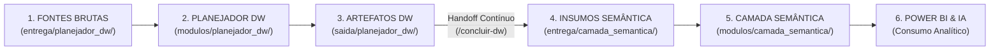

# NINHO — Plataforma Integrada de Engenharia, Modelagem & Governança de Dados

> *"Onde os dados brutos são acolhidos, cuidados e preparados para ganhar asas."*

Bem-vindo ao **NINHO**, o framework corporativo de engenharia analítica que automatiza o ciclo completo de dados: desde o planejamento dimensional de Data Warehouses no Oracle, passando pela geração de camadas semânticas ativas e governança em nuvem, até a entrega de diretrizes prontas para Power BI.

---

## 🎯 Por Onde Começar? (Guia por Papel e Objetivo)

> 👋 **Primeira vez usando o NINHO?** Comece pelo [**Guia Inicial do Engenheiro — Bem-vindo ao NINHO (`GUIA_INICIAL_ENGENHEIRO.md`)**](documentacao/guias/GUIA_INICIAL_ENGENHEIRO.md)! Ele explica de forma simples e passo a passo como o projeto funciona, o que cada pasta/script/skill faz e como rodar sua primeira tarefa em 5 minutos.

> ⚡ **Precisa de comandos rápidos ou queries operacionais?** Consulte o [**Guia Central de Comandos Rápidos & Cheat Sheet**](documentacao/guias/GUIA_COMANDOS_RAPIDOS.md) com sumário interativo ancorado cobrindo Python, Hop, Shell, Oracle SQL, DAX e Prompts da IA.

> 🛡️ **Público-Alvo Exclusivo:** O **NINHO** é uma plataforma corporativa 100% focada em **Engenheiros de Dados**. O Analista de BI **não possui acesso ao NINHO** e **não executa módulos**. Em vez disso, ao concluir o planejamento do DW, a plataforma gera automaticamente o artefato **`GUIA_ANALISTA_BI_<PROJETO>.md`** (em `saida/planejador_dw/08_datasets_bi/`). O Engenheiro de Dados exporta este guia e entrega à equipe externa de BI para orientar e acelerar a construção do painel no Power BI com máxima conformidade.

Não perca tempo procurando arquivos. Localize seu desafio abaixo e acesse diretamente os manuais, formulários, scripts e pastas correspondentes:

| Seu Papel / Desafio Atual | O que você deve ler | Onde colocar seus arquivos | Comando / Módulo de Execução | Onde ficam os resultados |
| :--- | :--- | :--- | :--- | :--- |
| 👋 **Iniciante na Plataforma**<br/>*(Entender tudo do zero)* | 🌟 [**Guia Inicial do Engenheiro**](documentacao/guias/GUIA_INICIAL_ENGENHEIRO.md)<br/>⚡ [Comandos Rápidos](documentacao/guias/GUIA_COMANDOS_RAPIDOS.md) | — | `python core/scripts_comuns/gerenciar_projeto.py --status` | — |
| 👷 **Engenheiro de Dados**<br/>*(Criar ou reformular um DW)* | 📘 [**Guia do Engenheiro de DW**](documentacao/guias/GUIA_ENGENHEIRO_DW.md)<br/>📋 [Formulário INTAKE_DW](modulos/planejador_dw/INTAKE_DW.md) | 📥 [`entrega/planejador_dw/`](entrega/planejador_dw/) | ⚙️ [`modulos/planejador_dw/`](modulos/planejador_dw/README.md)<br/>`/inspecionar-fontes` $\rightarrow$ `/simular-dw` $\rightarrow$ `/executar-simulacao-dw` | 📤 [`saida/planejador_dw/`](saida/planejador_dw/README.md) *(11 pastas + Guia de BI)* |
| 🧪 **Engenheiro — Simulador & Blueprint 100% Editável**<br/>*(Simular ponta a ponta e editar tabelas/colunas/KPIs antes de gerar)* | 📘 [Comandos Rápidos (Seção 1.12)](documentacao/guias/GUIA_COMANDOS_RAPIDOS.md#112-simulador-blueprint-editavel) | 📥 [`entrega/planejador_dw/`](entrega/planejador_dw/) ou [`entrega/camada_semantica/`](entrega/camada_semantica/) | `python core/scripts_comuns/simular_projeto.py --modulo {dw,semantica,ambos} --acao {simular,executar}`<br/>ou `/simular-dw`, `/simular-semantica` | 📋 `SIMULACAO_BLUEPRINT_DW.md` / `SIMULACAO_BLUEPRINT_SEMANTICA.md` $\rightarrow$ 📤 `saida/` |
| ⚡ **Engenheiro — DW Já Construído (Fast-Track & Micro-Processos)**<br/>*(Só Comentários, Índices, Dicionário, Linha `-1`, Selects ODI, Guia BI)* | 📘 [Comandos Rápidos (Seção 1.11)](documentacao/guias/GUIA_COMANDOS_RAPIDOS.md#111-melhorar-dw-existente)<br/>🧩 [Skill Planejador DW (Seção 5)](.agents/skills/planejador-dw-oracle/SKILL.md) | 📥 [`entrega/planejador_dw/ddl/`](entrega/planejador_dw/ddl/) (`.sql` do DW atual) | `python core/scripts_comuns/melhorar_dw_existente.py --modo {comentarios,dicionario,indices,linha-default,constraints,testes,guia-bi,selects-odi,guia-odi,tudo}` | 📤 [`saida/planejador_dw/`](saida/planejador_dw/README.md) *(`90_patch_*`, `91_patch_*`, `92_patch_*`, ODI, Dicionário HTML)* |
| 🦅 **Engenheiro ETL — ODI 12c**<br/>*(Auditar e fazer tuning de ODI)* | 🧩 [Skill Gerador/Auditor ODI](.agents/skills/gerador-consultas-odi/SKILL.md) | 📥 Pasta com XMLs (`Mapas`, `Cenas`, `Pacotes`, `Procedures`) | `python core/scripts_comuns/auditar_mapa_odi.py <pasta>`<br/>ou `/auditar-mapa-odi` | 📊 Diagnóstico preditivo (`H1` a `H9`) + SQL otimizado |
| 🐝 **Engenheiro ETL — Apache Hop**<br/>*(Auditar Hop `.hpl`/`.hwf`, FTPS e Python)* | 🧩 [Skill ETL Hop](.agents/skills/gerador-etl-hop/SKILL.md)<br/>🧩 [Skill FTPS Lote](.agents/skills/extrator-ftps-lote-hop/SKILL.md) | 📥 Pasta do projeto Hop (`.hpl`, `.hwf`, `.json`, `.py`, `.sh`) | `python core/scripts_comuns/auditar_esteira_hop.py <pasta>`<br/>ou `/auditar-hop` | 📊 Auditoria de segurança e qualidade (`HOP-H1` a `HOP-H8`) |
| 📊 **Engenheiro — Migração Power BI**<br/>*(Engenharia reversa de `.pbix` legado)* | 🧩 [Skill Engenharia Reversa PBIX](.agents/skills/engenharia-reversa-pbix/SKILL.md) | 📥 [`entrega/planejador_dw/`](entrega/planejador_dw/) (arquivo `.pbix`) | `python core/scripts_comuns/inspecionar_pbix.py <arquivo.pbix>`<br/>ou `/inspecionar-pbix` | 📤 Star Schema DW + DAX + Diagnóstico (`PBIX-H1` a `PBIX-H5`) |
| 🧠 **Engenheiro de Dados**<br/>*(Camada Semântica Completa ou Micro-Processos)* | 📘 [**Guia de Camada Semântica**](documentacao/guias/GUIA_ENGENHEIRO_SEMANTICA.md)<br/>📋 [Formulário INTAKE_SEMANTICA](modulos/camada_semantica/INTAKE_SEMANTICA.md) | 📥 [`entrega/camada_semantica/`](entrega/camada_semantica/) *(ou via `/concluir-dw`)* | `python core/scripts_comuns/modular_semantica.py --modo {views-dim,views-evento,views-kpi,catalogo-meta,rls,tudo}`<br/>ou `/simular-semantica`, `/iniciar-semantica` | 📤 [`saida/camada_semantica/`](saida/camada_semantica/) *(Views 3 níveis + 8 `META_*` + RLS)* |
| 🛡️ **Engenheiro de Governança**<br/>*(MongoDB PRODEB, AWS SageMaker Catalog, LAI/LGPD)* | 📘 [**README de Governança**](modulos/governanca_dados/README.md)<br/>📋 [Formulário INTAKE_GOVERNANCA](modulos/governanca_dados/INTAKE_GOVERNANCA.md)<br/>🏛️ [Arquitetura Mongo + AWS SageMaker](modulos/governanca_dados/ARQUITETURA_MONGO_AWS.md) | 📥 [`entrega/governanca_dados/`](entrega/governanca_dados/) (`.xlsx` e `.csv` do cliente) | `python core/scripts_comuns/inspecionar_insumos_governanca.py`<br/>ou `/inspecionar-governanca` | 📤 [`saida/governanca_dados/`](saida/governanca_dados/) *(Gate 0.5 Devolução ou Mongo+AWS)* |
| ✅ **Líder Técnico / QA**<br/>*(Validação, Qualidade e Empacotamento)* | 📋 [**Checklist de Validação**](documentacao/checklists/CHECKLIST_VALIDACAO.md)<br/>📜 [Convenções DW](core/convencoes/CONVENCOES_DW.md) | 📚 [Catálogo de Projetos](documentacao/catalogo_projetos/PROJETO_RESUMO.md) | `python core/scripts_comuns/validar_entrega.py all`<br/>`python core/scripts_comuns/gerenciar_projeto.py --status` | 📦 `pacotes_exportados/*.zip` |

---

## 🗺️ Mapa Completo de Navegação da Plataforma

```text
NINHO /
│
├── AGENTS.md                                  # 🤖 Orquestrador Principal do NINHO (Regras de Ouro & Gates)
├── 🤖 .agents/skills/                          # 🧩 SKILLS MODULARES & PROGRESSIVE DISCLOSURE
│   ├── planejador-dw-oracle/                   # Modelagem dimensional, SCD2, Sequences, Tuning, Índices e Fast-Track
│   ├── gerador-etl-hop/                        # Pipelines (.hpl) e workflows (.hwf) do Apache Hop 2.x
│   ├── gerador-consultas-odi/                  # Consultas analíticas, esteiras e motor preditivo de tuning ODI 12c
│   ├── extrator-api-python/                    # Extratores Python modulares (REST, OAuth2, bulk insert)
│   ├── extrator-ftps-lote-hop/                 # Ingestão em lote via FTPS/SFTP + Shell curl + Apache Hop
│   ├── camada-semantica-oracle/                # Views em 3 camadas, Micro-Processos e carga das 8 tabelas META_*
│   ├── seguranca-rls-oracle/                   # Row Level Security (RLS) e VPD (DBMS_RLS) no Oracle
│   ├── governanca-dados-corporativa/           # Governança PRODEB MongoDB, AWS SageMaker Catalog (ex-DataZone) e LGPD/LAI
│   ├── engenharia-reversa-pbix/                # Engenharia reversa de relatórios Power BI legados para DW
│   └── validador-qualidade-entrega/            # Validação pré-voo e gates automatizados de integridade
│
├── 🧠 core/                                    # NÚCLEO COMPARTILHADO & PADRÕES CORPORATIVOS
│   ├── convencoes/
│   │   ├── CONVENCOES_DW.md                    # 📜 DNA do DW (SCD2, B-Tree, Dual Strategy, Linha -1)
│   │   └── CONVENCOES_SEMANTICA.md             # 📜 DNA da Semântica (Views, 8 Tabelas META_, AI Rules)
│   ├── scripts_comuns/                         # 🛠️ Utilitários Python/SQL reutilizáveis
│   │   ├── ajuda_ninho.py                      # 🧭 Central de Ajuda interativa (/help) organizada por tópicos
│   │   ├── validar_entrega.py                  # 🔍 Validador pré-voo e pós-geração (Full, Fast-Track e Simulação)
│   │   ├── inspecionar_ddl_origem.py           # 🔎 Extrator determinístico de DDLs e Radar Consultivo de KPIs
│   │   ├── simular_projeto.py                  # 🧪 Gerador de Simulações e Blueprints 100% Editáveis (DW & Semântica)
│   │   ├── melhorar_dw_existente.py            # ⚡ Motor Fast-Track e Micro-Processos para DW & ODI
│   │   ├── modular_semantica.py                # 🧠 Motor de Micro-Processos da Camada Semântica (Views, META_*, RLS)
│   │   ├── inspecionar_insumos_governanca.py   # 🛡️ Auditor Gate 0.5 de planilhas/CSVs do cliente + DE/PARA MongoDB
│   │   ├── auditar_mapa_odi.py                 # 🦅 Motor preditivo de auditoria e tuning ODI 12c (H1 a H9)
│   │   ├── auditar_esteira_hop.py              # 🐝 Motor preditivo de auditoria Apache Hop & Python/FTPS (HOP-H1 a H8)
│   │   ├── inspecionar_pbix.py                 # 📊 Extrator e auditor de arquivos Power BI (.pbix, PBIX-H1 a H5)
│   │   ├── transicionar_dw_para_semantica.py   # 🔄 Handoff automatizado DW -> Camada Semântica
│   │   └── gerar_mock_dados.py                 # 🎲 Gerador de dados sintéticos para testes no Power BI
│   └── README.md                               # 📖 Visão geral do Core
│
├── 📥 entrega/                                 # ENTRADA DE DADOS (Insumos depositados pelo Usuário)
│   ├── planejador_dw/                          # 📁 DDLs de origem, amostras CSV, FTP e APIs
│   │   ├── ddl/                                # DDLs das tabelas transacionais de origem
│   │   ├── amostras/                           # Amostras reais de dados em CSV/Excel
│   │   ├── arquivos_ftp/                       # Layouts de arquivos recebidos via lote/SFTP
│   │   └── api_specs/                          # Swagger/OpenAPI e payloads JSON de APIs
│   ├── camada_semantica/                       # 📁 DDLs do DW Oracle, amostras e relatórios de carga
│   ├── governanca_dados/                       # 📁 Planilha padrão PRODEB (.xlsx), amostras (.csv) e LGPD/LAI
│   └── README.md                               # 📖 Roteiro de preenchimento dos insumos
│
├── ⚙️ modulos/                                 # MOTORES DE INTELIGÊNCIA & EXECUÇÃO
│   ├── planejador_dw/                          # 🏛️ MÓDULO 1: Planejamento e Modelagem de DW
│   │   ├── INTAKE_DW.md                        # 📋 Formulário de requisitos do novo DW
│   │   ├── AGENTS.md                           # 🤖 Orquestrador do módulo (chama skills sob demanda)
│   │   ├── templates/                          # 📄 14 templates (SQL, Hop, Py, BI, Testes, HTML)
│   │   └── README.md                           # 📖 Manual completo do módulo Planejador de DW
│   │
│   ├── camada_semantica/                       # 🧠 MÓDULO 2: Camada Semântica & Metadados Ativos
│   │   ├── INTAKE_SEMANTICA.md                 # 📋 Formulário de requisitos de semântica
│   │   ├── AGENTS.md                           # 🤖 Orquestrador da Camada Semântica (chama skills)
│   │   ├── templates/                          # 📄 Templates de views analíticas e tabelas META_
│   │   └── README.md                           # 📖 Manual completo da Camada Semântica
│   │
│   ├── governanca_dados/                       # 🛡️ MÓDULO 3: Governança PRODEB MongoDB & AWS SageMaker Catalog
│   │   ├── INTAKE_GOVERNANCA.md                # 📋 Formulário de requisitos de governança e Gate 0.5
│   │   ├── AGENTS.md                           # 🤖 Orquestrador de Governança (Gate 0.5 de devolução ao cliente)
│   │   ├── ARQUITETURA_MONGO_AWS.md            # 🏛️ Arquitetura MongoDB Enterprise + AWS Glue & SageMaker Catalog
│   │   ├── DOCUMENTO_CONSOLIDADO_GOVERNANCA_DADOS.md # 📘 Padrão PRODEB MongoDB ($jsonSchema, BSON, 5 coleções)
│   │   ├── CAMADA_SEMANTICA_GOVERNANCA_DADOS_MONGODB.md # 🧠 Camada Semântica (tb_sem_dominios e tb_sem_conceitos)
│   │   ├── templates/                          # 📄 Template oficial Excel (Dados - Insumos / Dicionário de Dados)
│   │   └── README.md                           # 📖 Manual do módulo de Governança
│   │
│   └── README.md                               # 📖 Visão integrada dos módulos
│
├── 📚 documentacao/                            # GOVERNANÇA, MANUAIS & CATALOGAÇÃO CONSOLIDADA
│   ├── guias/                                  # 📘 MANUAIS OPERACIONAIS PASSO A PASSO
│   │   ├── GUIA_INICIAL_ENGENHEIRO.md          # 👋 Guia de boas-vindas e onboarding para iniciantes
│   │   ├── GUIA_COMANDOS_RAPIDOS.md            # ⚡ Cheat sheet central (Python, Bash, Hop, SQL, DAX)
│   │   ├── GUIA_ENGENHEIRO_DW.md               # Manual prático do Engenheiro de DW (ODI, Hop, SQL)
│   │   ├── GUIA_ENGENHEIRO_SEMANTICA.md        # Manual prático de Camada Semântica
│   │   └── GUIA_ANALISTA_BI.md                 # Manual corporativo de BI (Power BI, DAX, Star Schema)
│   ├── GLOSSARIO.md                            # 📖 Glossário analítico (SCD2, VertiPaq, Linha -1, Star Schema)
│   ├── checklists/
│   │   └── CHECKLIST_VALIDACAO.md              # ✅ Checklist de integridade e homologação pré-entrega
│   ├── catalogo_projetos/
│   │   ├── PROJETO_RESUMO.md                   # 📄 Ficha técnica viva do projeto ativo
│   │   └── PROJETO_VERSION.md                  # 📜 Histórico de versionamento incremental
│   └── README.md                               # 📖 Índice central da documentação
│
└── 📤 saida/                                   # ARTEFATOS FINAIS GERADOS PARA IMPLANTAÇÃO
    ├── planejador_dw/                          # 📦 Entregáveis do DW (direto nas 11 subpastas canônicas)
    │   ├── 01_controle_carga/                  # Script TB_CONTROLE_CARGA
    │   ├── 02_staging/                         # DDLs das tabelas STG_*
    │   ├── 03_dimensoes/                       # DDLs DIM_*, ODI_DIM_*, Sequences e linha -1
    │   ├── 04_fatos/                           # DDLs FATO_* (Estratégia A ou B)
    │   ├── 05_procedimentos_manutencao/        # Procedure PRC_POS_CARGA_FATO
    │   ├── 06_pipelines_hop/                   # Pipelines Hop (.hpl / .hwf) (se solicitado)
    │   ├── 07_extratores_python/               # Extratores Python modulares (se solicitado)
    │   ├── 08_datasets_bi/                     # Guia de Modelagem e Handoff Power BI
    │   ├── 09_relatorio_estrategias/           # Relatório executivo de arquitetura
    │   ├── 10_testes_integridade/              # Scripts de testes pós-carga
    │   └── 11_dicionario_dados/                # Dicionário de dados HTML
    ├── camada_semantica/                       # 📦 Views analíticas geradas e cargas nas 8 tabelas META_
    ├── governanca_dados/                       # 📦 Schemas MongoDB, AWS SageMaker Catalog e Relatórios Gate 0.5
    └── README.md                               # 📖 Catálogo de saídas da plataforma
```

---

## 🔄 Fluxo de Trabalho Integrado (Pipeline Contínuo de Ponta a Ponta)


```mermaid
flowchart LR
    A["1. FONTES BRUTAS<br/>(entrega/planejador_dw/)"] --> B["2. PLANEJADOR DW<br/>(modulos/planejador_dw/)"]
    B --> C["3. ARTEFATOS DW<br/>(saida/planejador_dw/)"]
    C -->|"Handoff Contínuo<br/>(/concluir-dw)"| D["4. INSUMOS SEMÂNTICA<br/>(entrega/camada_semantica/)"]
    D --> E["5. CAMADA SEMÂNTICA<br/>(modulos/camada_semantica/)"]
    E --> F["6. POWER BI & IA<br/>(Consumo Analítico)"]
```

1. **Depósito de Insumos (`entrega/planejador_dw/`):** Você deposita DDLs de origem, amostras CSV/Excel ou especificações de APIs.
2. **Planejamento & Modelagem Dimensional:** Você preenche `INTAKE_DW.md` e a IA planeja a esteira híbrida (Hop + Python + ODI), SCD Tipo 2, tabela de controle e estratégia de carga.
3. **Geração Automatizada de Código DW (`saida/planejador_dw/`):** A IA gera todos os DDLs (`STG_*`, `ODI_DIM_*`, `DIM_*`, `FATO_*`), procedures de manutenção, pipelines Hop, extratores Python e o `RELATORIO_ESTRATEGIAS.md`.
4. **Handoff Automático & Documentação Central (`/concluir-dw`):** O pipeline **não para** no DW! Com o comando `/concluir-dw` ou via script CLI, a plataforma consolida os DDLs, transfere/gera amostras, move relatórios, preenche o `INTAKE_SEMANTICA.md` e atualiza o catálogo corporativo (`PROJETO_RESUMO.md` e `PROJETO_VERSION.md`).
5. **Geração da Camada Semântica (`saida/camada_semantica/`):** A IA gera as views analíticas (`VW_DIM_*_ATUAL`, `VW_EVENTO`, `VW_KPI_*`) e os scripts de carga para as 8 tabelas `META_*`.
6. **Handoff para BI & Governança:** O Engenheiro de Dados exporta o `GUIA_ANALISTA_BI_<PROJETO>.md` (gerado na pasta `08_datasets_bi/`) e o entrega à equipe externa de BI para a construção autônoma dos painéis no Power BI. Paralelamente, o time de governança conecta o catálogo ao Lakehouse Mongo / AWS SageMaker Catalog.

---

## 💬 Dicionário Rápido de Comandos do Chat (`/comando`)

> 📖 Para ver a explicação detalhada do que cada comando faz por trás dos panos e exemplos prontos, acesse a [**Seção 3.3 do Guia Inicial do Engenheiro (`GUIA_INICIAL_ENGENHEIRO.md`)**](documentacao/guias/GUIA_INICIAL_ENGENHEIRO.md#33-dicionario-comandos-chat).

| Categoria | Comando no Chat | O que a IA Faz |
| :--- | :--- | :--- |
| 🧭 **Central de Ajuda** | **`/help`** (ou **`/ajuda`**, **`/comandos`**, **`/help <topico>`**) | Lista diretamente aqui no chat todos os comandos organizados por tópico (`simulacao`, `micro`, `auditoria`, `dw`, `semantica`, `governanca`, `qualidade`) (`ajuda_ninho.py`). |
| 🔍 **Inspeção & Auditoria** | **`/inspecionar-fontes`** | Lê os DDLs/CSVs de `entrega/planejador_dw/`, extrai colunas/PKs e sugere KPIs (`inspecionar_ddl_origem.py`). |
| 🔍 **Inspeção & Auditoria** | **`/inspecionar-pbix`** | Desconstrói relatórios `.pbix` do Power BI, extrai DAX, filtros ocultos e anti-padrões `PBIX-H1` a `PBIX-H5` (`inspecionar_pbix.py`). |
| 🔍 **Inspeção & Auditoria** | **`/auditar-mapa-odi`** | Audita XMLs ou pastas do ODI 12c (`Mapas`, `Cenas`, `Pacotes`, `Procedures`) com as heurísticas `H1` a `H9` (`auditar_mapa_odi.py`). |
| 🔍 **Inspeção & Auditoria** | **`/auditar-hop`** | Audita projetos Apache Hop 2.x (`.hpl`, `.hwf`, `.json`), scripts FTPS e Python com as heurísticas `HOP-H1` a `HOP-H8` (`auditar_esteira_hop.py`). |
| 🔍 **Inspeção & Auditoria** | **`/inspecionar-governanca`** | Executa o Gate 0.5 sobre planilhas `.xlsx` e `.csv` do cliente: emite o Relatório de Devolução ou a Matriz DE/PARA MongoDB (`inspecionar_insumos_governanca.py`). |
| 🏛️ **Modelagem DW** | **`/desafiar-grao`** | Propõe e compara alternativas de granularidade para a tabela Fato contra as perguntas de negócio. |
| 🏛️ **Modelagem DW** | **`/classificar-scd`** | Classifica atributos das dimensões entre Chave Natural (`ID_*`), SCD Tipo 1 e SCD Tipo 2 (histórico). |
| 🏛️ **Modelagem DW** | **`/definir-estrategia-carga`** | Recomenda e justifica entre Estratégia A (Truncate & Load + Bitmap) e Estratégia B (MERGE Incremental + B-Tree). |
| 🏛️ **Modelagem DW** | **`/gerar-blueprint`** | Monta a proposta completa do DW (Star Schema, Matriz De/Para fiel à origem e **💡 Radar Consultivo da IA**) sem gerar código ainda. |
| 🏛️ **Modelagem DW** | **`/aprovar-blueprint`** | Libera o Gate de aprovação e gera todos os scripts DDL, procedures, ETL e Guia de BI nas 11 pastas de `saida/planejador_dw/`. |
| 🏛️ **Modelagem DW** | **`/auditar-ddl`** | Confere sintaxe Oracle, linha `-1`, sequences e índices dos scripts gerados. |
| 🧪 **Simulador & Blueprint Editável** | **`/simular-dw`** / **`/executar-simulacao-dw`** | Gera `SIMULACAO_BLUEPRINT_DW.md` 100% editável (tabelas, colunas `[x]/[ ]`, tipos, SCD, prévia 3 linhas + `-1`, KPIs) e, após aprovado, executa na esteira real (`simular_projeto.py --modulo dw`). |
| 🧪 **Simulador & Blueprint Editável** | **`/simular-semantica`** / **`/executar-simulacao-semantica`** | Gera `SIMULACAO_BLUEPRINT_SEMANTICA.md` 100% editável (Views 3 camadas, KPIs, RLS, 8 `META_*`) e, após aprovado, executa na esteira real (`simular_projeto.py --modulo semantica`). |
| ⚡ **Micro-Processos DW & ODI** | **`/gerar-comentarios`** / **`/gerar-dicionario`** | Gera apenas `COMMENT ON TABLE / COLUMN` (`--modo comentarios`) ou apenas o `dicionario_dados.html` (`--modo dicionario`). |
| ⚡ **Micro-Processos DW & ODI** | **`/gerar-indices`** / **`/gerar-linha-default`** / **`/gerar-constraints`** | Gera apenas índices + `PRC_POS_CARGA_FATO` (`--modo indices`), apenas `MERGE` da linha `-1` (`--modo linha-default`) ou apenas constraints `NOVALIDATE` (`--modo constraints`). |
| ⚡ **Micro-Processos DW & ODI** | **`/gerar-testes-dw`** / **`/gerar-guia-bi`** | Gera apenas os 6 testes SQL pós-carga (`--modo testes`) ou apenas o `GUIA_ANALISTA_BI_<PROJETO>.md` (`--modo guia-bi`). |
| ⚡ **Micro-Processos DW & ODI** | **`/gerar-selects-odi`** / **`/gerar-guia-odi`** | Gera apenas as queries SQL do ODI (`03_selects_odi_dimensoes.sql` + `04_select_odi_fato.sql`) ou apenas o Guia do Canvas ODI 12c (`--modo selects-odi` / `--modo guia-odi`). |
| ⚡ **Fast-Track DW Completo** | **`/melhorar-dw-existente`** | Executa o Raio-X não-destrutivo e gera o pacote completo de melhorias sem mexer no ETL (`melhorar_dw_existente.py --modo tudo`). |
| 🧠 **Micro-Processos Semântica** | **`/gerar-views-dim`** / **`/gerar-views-evento`** / **`/gerar-views-kpi`** | Gera individualmente a Camada 1 (`VW_DIM_*_ATUAL`), Camada 2 (`VW_EVENTO_*`) ou Camada 3 (`VW_KPI_*`) (`modular_semantica.py`). |
| 🧠 **Micro-Processos Semântica** | **`/gerar-catalogo-meta`** / **`/gerar-rls-semantica`** | Gera apenas o DDL + INSERT das 8 tabelas `META_*` (`--modo catalogo-meta`) ou apenas a segurança VPD/RLS (`--modo rls`). |
| 🧠 **Semântica & Cloud** | **`/concluir-dw`** / **`/iniciar-semantica`** | Transfere os DDLs/amostras do DW (`transicionar_dw_para_semantica.py`) e gera a Camada Semântica completa em `saida/camada_semantica/`. |
| 🧠 **Semântica & Cloud** | **`/gerar-governanca`** | Gera os scripts das 5 coleções MongoDB padrão PRODEB, matriz LGPD/LAI e artefatos para AWS Glue & SageMaker Catalog em `saida/governanca_dados/`. |
| ✅ **Qualidade & Entrega** | **`/validar-entrega`** | Executa a bateria de auditoria pré-voo e pós-geração da pasta `saida/` (`validar_entrega.py`). |
| ✅ **Qualidade & Entrega** | **`/diagnosticar-erro-carga`** | Analisa erros de execução (`ORA-xxxxx`, logs ODI/Hop) e gera o script de correção e reprocessamento seguro. |
| ✅ **Qualidade & Entrega** | **`/empacotar-projeto`** | Exporta a entrega final em `.zip` para `pacotes_exportados/` e/ou limpa o workspace (`gerenciar_projeto.py`). |

